# Citrus

Citrus is a distributed, cloud-native infrastructure that handles and process incoming data in real time.

## Architecture



On a high level overview, Citrus is a two cluster system. 
The first cluster is responsible for receiving data from the outside world and 
the second cluster is responsible for processing the data.

## Modules

Citrus is composed of the following modules:

- [Protobuf](protobuf)
- [Aurantium](aurantium)
- [Sunki](sunki)
- [Pomelo](pomelo)

In short, Aurantium is the data source, Sunki is the connector and Pomelo is the processor.
Protobuf serves as the protocol used to communicate between the modules.

## Prerequisites

In what follows, we assume that you have Java 17, Maven 3.1, Docker Engine 24.0.6, kubectl 1.28.2 installed on an Ubuntu 22 machine.
Consider the versions as a guideline. Other versions might work as well.

Also, consider running ```bash citrus-paths.sh``` as it downloads the binary files needed for the running each module.

## Maven Build

Run from the root directory of the project to build the .jar files.

``` mvn clean install -DskipTests ```

## Local Run each Module

See the README of each module for more details.

## Docker Build

Run from the root directory of the project to build the Docker image(s).

```docker compose build```

## Kubernetes Deploy

Run from the root directory of the project to deploy the Kubernetes cluster(s).

``` bash citrus-setup.sh```

When prompt for credentials on the Grafana dashboard, see the [Grafana](pomelo/cluster-setup/metrics/grafana) section for more details.

When done, run the following command to delete the Kubernetes cluster(s).

``` bash citrus-teardown.sh```

